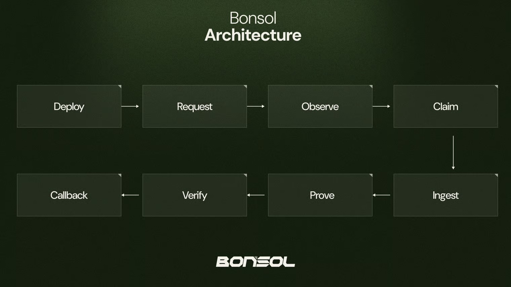

# Architecture

## Overview

Bonsol is a framework for building verifiable computation on Solana. It consists of tools and libraries that enable developers to create their own verifiable programs and prove computations that would be impossible to run on-chain. In addition to being a development framework, Bonsol also operates as a prover network, allowing computations to be executed by a distributed network of provers incentivized to process them as quickly as possible.

## Incentive Mechanism

The prover network operates through a claim mechanism. Provers observe the blockchain for execution requests, and when they identify a request they consider worthwhile (based on various heuristics), they can claim it and submit the proof to the blockchain. The first prover to claim a request is allocated a specific timeframe (measured in blocks) to deliver the proof, which must be less than the execution request's expiry. If a prover fails to deliver within the deadline, the request expires, invalidating the claim and allowing other provers to step in. Once a claim is made, the execution request is marked as claimed, and the tip value decreases according to a predefined curve, providing an incentive for the prover to generate the proof quickly.

## Core Components

Bonsol consists of several key components that work together to enable verifiable off-chain computation:

Provers

Provers are nodes that form the Bonsol network. They monitor transactions submitted to the Bonsol program on-chain, decide whether to claim execution requests, and submit proofs back to the verifier. The prover component is responsible for:

* Observing the blockchain for computation requests
* Ingesting the required data
* Performing off-chain computations
* Generating cryptographic proofs of those computations
* Submitting results and proofs back to the blockchain

Verifier

The verifier runs as a program on Solana and is responsible for:

* Verifying the cryptographic proofs submitted by provers
* Validating the integrity of the computation results
* Forwarding the validated output to the callback program

Callback Program

The callback program is developed by the application developer and receives output from the verifier. It can perform any desired actions with the verified results, such as:

* Updating on-chain state based on verified computation results
* Triggering additional on-chain processes
* Emitting events for off-chain systems to observe

## Workflow

The Bonsol workflow follows these steps:

1. **Deployment**: A zkprogram is deployed and registered on-chain
2. **Request**: An on-chain program requests computation through Bonsol
3. **Observation**: Prover nodes observe the request on the blockchain
4. **Claim**: A prover claims the request
5. **Ingestion**: The prover ingests the program and input data
6. **Computation & Proving**: Off-chain computation is performed, and a proof is generated
7. **Verification**: Results and proofs are submitted on-chain for verification
8. **Callback**: The verifier forwards verified results to the callback program to perform actions based on the verified results

<figure><figcaption></figcaption></figure>
