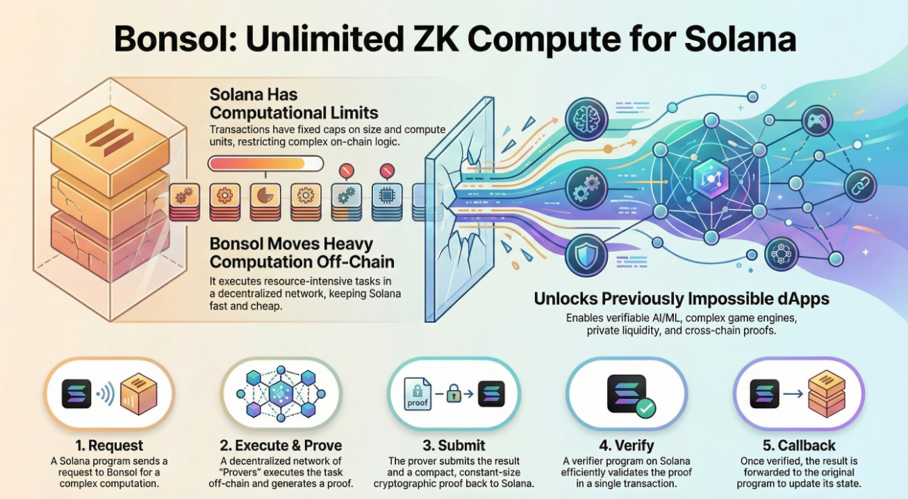
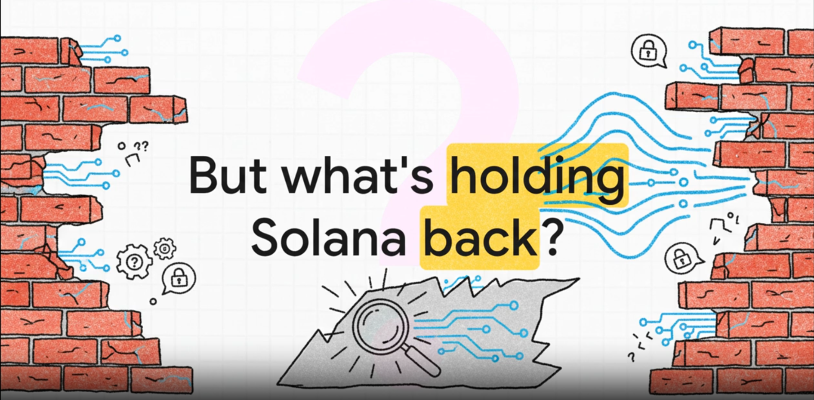
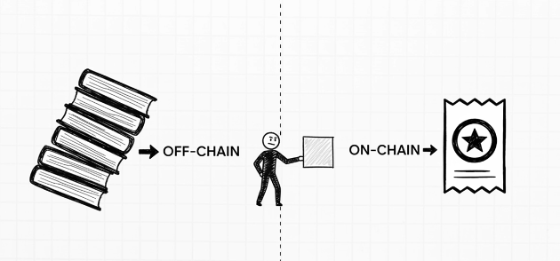
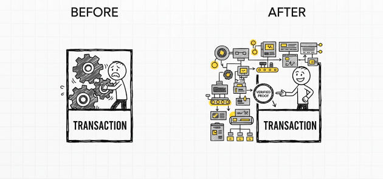

# Introduction

Blockchains are excellent at verifying things, but they struggle with heavy computation. That’s why most complex logic still runs off-chain fast, but not trustless. What if you could keep the speed of off-chain compute while still proving that everything ran correctly?

That’s exactly what Bonsol enables.

Bonsol lets you run any program off-chain and generate a zero-knowledge proof that the execution was correct. This proof is extremely small and can be verified cheaply on Solana. Under the hood, it uses **RISC Zero’s STARK proofs** for strong security, and then compresses them into a **Groth16 SNARK** for on-chain verification.

> **Bonsol shifts Solana from a system limited by what fits into a transaction  
> to a system powered by what can be proven to a transaction.**

## Solana’s Hidden Limit

<!--  -->

Solana is incredibly fast, but it achieves that speed by enforcing strict limits on what a single transaction can do.

| **Limitation**              | **Meaning**                                             |
|-----------------------------|---------------------------------------------------------|
| **Compute Unit caps**       | Only a small amount of computation can run on-chain.    |
| **Transaction size limits** | Large inputs, payloads, or datasets cannot fit.         |
| **Execution time caps**     | Long or CPU-heavy logic isn’t allowed.                 |

Because of these constraints, you cannot run ML models, simulations, large dataset processing, or complex verification logic inside a Solana program.

These limits aren’t flaws—they keep Solana predictable and fast.

Bonsol removes these constraints safely by shifting all heavy computation off-chain and proving correctness back on-chain.

## The Off-Chain Workflow (The Bonsol Model)

**Heavy work happens off-chain.  
Correctness is enforced on-chain.**

Bonsol divides computation into two worlds:

### **Off-chain:**
- Unlimited CPU, memory, and execution time  
- You can run anything: ML inference, simulations, BP decoding, game engines, ZK circuits  
- No restrictions on data size or complexity  

### **On-chain:**
- Solana receives a tiny Groth16 proof  
- The program verifies correctness instantly  
- No need to trust the prover  

This unlocks a new programming approach:

Instead of writing on-chain programs that *do the work*,  
you write programs that *verify the work*.

## How Bonsol Works

Here’s the full pipeline:

### **1. Write a normal Rust program**
This becomes your “guest program.”  
RISC Zero compiles and runs it inside a zkVM.

### **2. A prover executes it off-chain**
This can be:
- Your local machine  
- A backend server  
- A decentralized prover network  

RISC Zero generates a **STARK proof** of execution.

### **3. Bonsol converts STARK → Groth16 SNARK**

Why convert?

- STARKs: large (100s of KB)  
- Groth16 SNARKs: tiny (~200 bytes)  
- Groth16 verifies in <200k CU on Solana  

This conversion step makes native Solana verification possible.

### **4. Solana verifies the SNARK**
If the proof verifies:
- The computation definitely ran correctly  
- The outputs are authentic  
- Inputs match the on-chain digest  
- No prover can forge or skip logic  

### **5. Bonsol invokes your callback program**
Your Solana program receives:
- Proven outputs  
- Execution metadata  
- Input digest for tamper-proofing  

## Why Bonsol Uses STARKs + SNARKs (Hybrid Approach)

**STARK (RISC Zero stage) advantages**
- Transparent (no trusted setup)  
- Post-quantum secure  
- Best for large programs  

**SNARK (Groth16 stage) advantages**
- Very small proofs  
- Extremely cheap to verify on Solana  
- Perfect for blockchain constraints  

**Hybrid = the best of both**
- **STARK → freedom to compute anything**  
- **SNARK → freedom to verify on-chain cheaply**  

## Input Digest Verification (Preventing Input Forgery)

Bonsol ensures provers cannot cheat by modifying inputs.

Every guest program must:
- Compute a digest (hash) of all input bytes  
- Commit that digest inside the proof  
- Have it validated against the on-chain expected digest  

If even one byte changes:
- Digest mismatch  
- Proof rejected  
- Prover ignored or penalized  

This guarantees correctness and avoids tampering.

## When to Use Bonsol (Real Use Cases)

Below are **some practical examples**.

### **1. Verifiable Compute**
Run complex logic off-chain—AI inference, simulations, risk checks—and prove the result on-chain without re-executing it.

### **2. Storage & Transaction Proofs**
Prove that a specific transaction or piece of historical data is valid without replaying all logic on-chain.

### **3. Verifiable Oracles**
Fetch external data, validate signatures or TLS sessions off-chain, and submit a proof instead of raw data.

### **4. Gaming & Fairness**
Create fair raffles, hidden-state games, or randomness-heavy mechanics where results are provably correct.

## Conclusion

If it’s too heavy, too big, **Bonsol is the right tool.** 
<!-- or too private for Solana, -->

Bonsol unlocks a new category of applications by allowing Solana programs to verify  
what previously could not even be computed on-chain.
