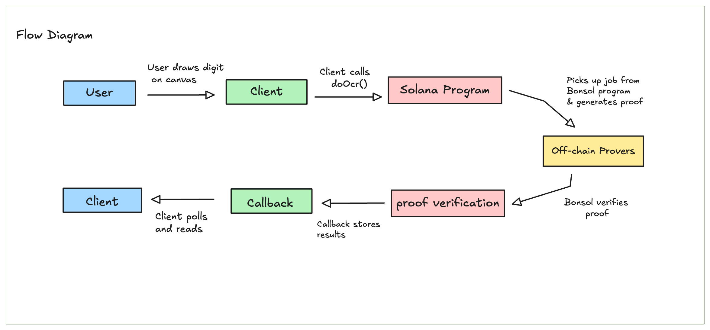
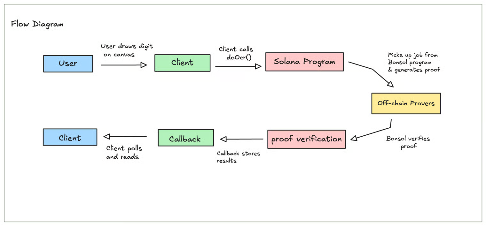

# AI OCR Example

This guide walks you through building applications that leverage zero-knowledge proofs on Solana using the Bonsol framework. We'll use an OCR (Optical Character Recognition) example that runs a machine learning model off-chain while maintaining cryptographic accountability on-chain.

### How Bonsol Works

Bonsol enables you to move computation off-chain while keeping full transparency and verification on-chain:

1. **Your app calls your Solana program** with input data
2. **Your program schedules a ZK job** by calling the Bonsol program
3. **Bonsol provers pick up the job**, download your ZK program image, execute it, and generate a proof
4. **Bonsol verifies the proof** and calls your program back with the results
5. **Your program processes the verified results** on-chain

This architecture lets you run expensive computations (like ML inference, complex algorithms, or data processing) off-chain while maintaining the security guarantees of on-chain execution.

### Architecture Overview

<figure><figcaption></figcaption></figure>

### Step 1: Building the ZK Program

Your ZK program runs inside the RISC0 zkVM. It reads inputs, performs computation, and commits outputs that will be verified on-chain.

#### Basic Structure

```rust
use risc0_zkvm::guest::env;

fn main() {
    // 1. Read input data
    let mut input_data = [0u8; DATA_SIZE];
    env::read_slice(&mut input_data);

    // 2. Process the data
    let result = process(input_data);

    // 3. Commit the output (this becomes your verified result)
    env::commit_slice(&result);
}

```

#### OCR Example

In our OCR example, we read a 28×28 pixel image (packed as bits), run it through a neural network, and output class probabilities:

```rust
fn main() {
    // Read 98 bytes (28*28 pixels / 8 bits)
    let mut image_bits = [0u8; IMAGE_BITS_SIZE];
    env::read_slice(&mut image_bits);

    // Unpack bits to floats
    let mut image = vec![0.0_f32; IMAGE_SIZE];
    for idx in 0..IMAGE_SIZE {
        image[idx] = ((image_bits[idx / 8] >> (7 - idx % 8)) & 1) as f32;
    }

    // Run ML inference
    let output: Vec<f32> = inference::Mnist::new().inference(&image).unwrap();

    // Commit results to be verified on-chain
    env::commit_slice(&output);
}

```

**Key points:**

* Use `env::read_slice()` to read input data
* Use `env::commit_slice()` to output results that will be available on-chain
* Keep your program focused and efficient while you're generating proofs of execution

#### 1.1: Building and Deploying

```bash
# Build your ZK program
bonsol build

# Deploy to an image server
bonsol deploy url --url [your-image-server] --manifest-path manifest.json

```

For development, start a local image server:

```bash
cargo run -p local-zk-program-server

```

Your program gets a unique image ID (SHA256 hash) that you'll reference on-chain.

### Step 2: Writing the Solana Program

Your Solana program acts as the orchestrator as it receives requests from users and schedules ZK jobs with Bonsol.

#### 2.1: Scheduling a ZK Execution

```rust
use bonsol_interface::instructions::{execute_v1, CallbackConfig, ExecutionConfig, InputRef};

pub fn do_ocr(
    ctx: Context<DoOcr>,
    execution_id: String,
    image_bits: [u8; 98],
    tip: u64,
) -> Result<()> {
    let slot = Clock::get()?.slot;

    let ix = execute_v1(
        ctx.accounts.payer.key,           // Requester
        ctx.accounts.payer.key,           // Payer for execution
        AI_IMAGE_ID,                      // Your ZK program's image ID
        &execution_id,                    // Unique execution identifier
        vec![InputRef::public(&image_bits)], // Input data
        tip,                              // Tip for provers (in lamports)
        slot + 100000000,                 // Expiration slot
        ExecutionConfig {
            forward_output: true,         // Send output to callback
            verify_input_hash: false,
            input_hash: None,
        },
        Some(CallbackConfig {
            program_id: crate::id(),
            instruction_prefix: vec![245, 250, 10, 62, 218, 252, 239, 91], // Callback discriminator
            extra_accounts: vec![
                AccountMeta::new(ctx.accounts.ai_result.key(), false)
            ],
        }),
        None,
        vec![],                           // Authorized provers (recommended)
    )?;

    invoke(&ix, &ctx.accounts.to_account_infos())?;
    Ok(())
}

```

**Key parameters:**

* **execution\_id**: Unique identifier for this execution (used to derive PDAs)
* **image\_id**: The SHA256 hash of your deployed ZK program
* **InputRef::public()**: Marks data as public input (there's also `InputRef::private()`)
* **tip**: Incentivizes provers to pick up your job quickly
* **CallbackConfig**: Tells Bonsol how to call your program back with results
* **Authorized provers:** A list of the public keys of provers that are authorized to run this job. It's recommended to use only trusted/performing provers.

#### 2.2: Receiving Results via Callback

```rust
pub fn callback(ctx: Context<Callback>, result: [f32; 10]) -> Result<()> {
    // Bonsol calls this after verification
    ctx.accounts.ai_result.result = result;
    Ok(())
}

#[derive(Accounts)]
pub struct Callback<'info> {
    /// CHECK: Verified by Bonsol
    pub execution_request: UncheckedAccount<'info>,

    #[account(mut)]
    pub ai_result: Account<'info, AiResult>,
}

```

**Important:** The callback is only invoked if the proof verification succeeds, in production you should verify that callback was called from our program.

#### 2.3: Account Structure

```rust
#[derive(Accounts)]
#[instruction(execution_id: String)]
pub struct DoOcr<'info> {
    #[account(mut)]
    pub payer: Signer<'info>,

    // Store results here
    #[account(
        init,
        payer = payer,
        space = 8 + 40,
        seeds = [b"ai_result", execution_id.as_bytes(), payer.key().as_ref()],
        bump
    )]
    pub ai_result: Account<'info, AiResult>,

    /// CHECK: Bonsol execution request PDA
    #[account(mut)]
    pub execution_request: AccountInfo<'info>,

    /// CHECK: Bonsol deployment account
    pub deployment_account: AccountInfo<'info>,

    #[account(executable, address = bonsol_interface::id())]
    pub bonsol_program: AccountInfo<'info>,

    pub system_program: Program<'info, System>,
}

```

### Step 3: Building the Client

The client coordinates PDAs, submits transactions, and polls for results.

#### 3.1: Deriving Program-Derived Addresses

To schedule a ZK job you typically need 3 accounts:

* the execution request account: this is where the execution request will be stored, and later picked up by provers
* the deployment account: this is the account that informs provers about your program’s deployment (where to download it from, what inputs it takes, etc.).
* the result account: This is optional but you’ll typically want to store your ZK program’s output somewhere.

```tsx
import { PublicKey } from "@solana/web3.js";
import keccak256 from "keccak256";

// Your result account
const [aiResultPda] = PublicKey.findProgramAddressSync(
  [Buffer.from("ai_result"), Buffer.from(executionId), payer.toBuffer()],
  AI_PROGRAM_ID
);

// Bonsol execution request account
const [executionRequestPda] = PublicKey.findProgramAddressSync(
  [Buffer.from("execution"), payer.toBuffer(), Buffer.from(executionId)],
  BONSOL_PROGRAM_ID
);

// Bonsol deployment account (from image ID)
const deriveDeploymentAccount = (imageIdSha256Hex: string): PublicKey => {
  const hash = keccak256(Buffer.from(imageIdSha256Hex));
  const [deploymentPda] = PublicKey.findProgramAddressSync(
    [Buffer.from("deployment"), hash],
    BONSOL_PROGRAM_ID
  );
  return deploymentPda;
};

```

#### 3.2: Submitting an Execution Request

After all the accounts are derived, we schedule a new job calling our program (which in turn will call Bonsol’s program).

```tsx
const executionId = `ocr_${Date.now()}_${wallet.publicKey.toString().substring(0, 8)}`;

const tx = await program.methods
  .doOcr(executionId, imageBits, new anchor.BN(tipLamports))
  .accounts({
    payer: wallet.publicKey,
    aiResult: aiResultPda,
    executionRequest: executionRequestPda,
    deploymentAccount: deriveDeploymentAccount(IMAGE_ID),
  })
  .rpc();

```

#### 3.3: Polling for Results

Since ZK proof generation happens off-chain asynchronously, you need to poll for results:

```tsx
const pollForAiResult = async (
  connection: Connection,
  wallet: AnchorWallet,
  executionId: string,
  maxDurationSeconds: number = 3600,
  pollIntervalSeconds: number = 10
): Promise<{ found: boolean; result?: number[] }> => {
  const startTime = Date.now();

  while (Date.now() - startTime < maxDurationSeconds * 1000) {
    try {
      const account = await program.account.aiResult.fetchNullable(aiResultPda);

      if (account && account.result.some(v => v !== 0)) {
        return { found: true, result: account.result };
      }
    } catch (e) {
      // Account not initialized yet
    }

    await new Promise(resolve => setTimeout(resolve, pollIntervalSeconds * 1000));
  }

  return { found: false };
};

```

### Complete Flow Example

The entire flow includes the following steps:

1. **User draws digit on canvas** → Exports as 98-byte bit array
2. **Client calls `doOcr()`** → Creates execution request on-chain
3. **Solana program calls Bonsol** → Schedules ZK job with image data
4. **Off-chain prover:**
   * Picks up job from Bonsol program
   * Downloads ZK program image
   * Executes ML inference in zkVM
   * Generates proof
   * Submits proof + output to Bonsol
5. **Bonsol verifies proof** → Calls your program's callback
6. **Callback stores results** → Writes to `ai_result` account
7. **Client polls and reads** → Displays recognized digit

<figure><figcaption><p>Revisiting the flow diagram for Bonsol AI OCR Example</p></figcaption></figure>

### Best Practices

**Execution IDs:** Use unique, descriptive identifiers. Include timestamps and user info to avoid collisions:

```tsx
const executionId = `${operation}_${Date.now()}_${wallet.publicKey.toString().slice(0, 8)}`;

```

**Tips:** Higher tips incentivize faster proof generation. Balance cost vs. speed based on your use case.

**Input Data:** Keep inputs small when possible, as they’re committed to on-chain transactions.

For large data, consider using hashes and storing data off-chain.

**Error Handling:** Always handle cases where proofs time out or fail. Provide feedback to users.

**Testing:** Use devnet for development. Start a local image server for rapid iteration.

### Summary

Bonsol lets you build powerful Solana applications that leverage off-chain computation while maintaining on-chain verification:

* **Write ZK programs** that perform complex computations
* **Deploy them** to accessible image servers
* **Schedule executions** from your Solana program
* **Receive verified results** via callbacks
* **Build UIs** that poll for results asynchronously

This pattern works for ML inference, complex algorithms, data processing, and any computation too expensive for on-chain execution but requiring cryptographic accountability.

For now, our proof of concept demo only works with numbers since training was done on the MNIST dataset with numbers only. To expand into other use cases like verifying characters, you simply have to train the AI model with a dataset such as the EMNIST dataset which includes letters, both lowercase and uppercase.
