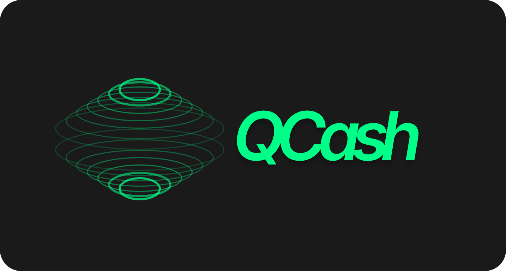
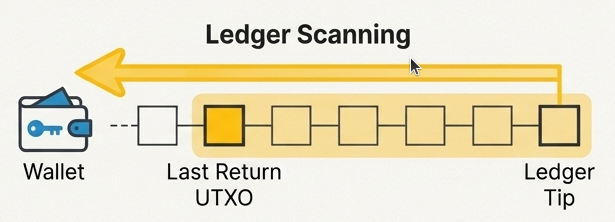
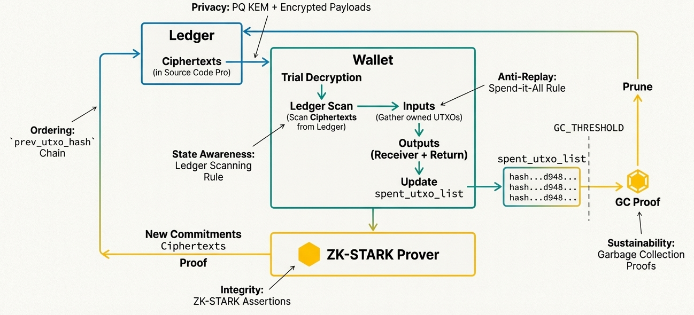

# QCash

<figure><figcaption></figcaption></figure>

Private cash today is built on a foundation of sand using cryptography that will inevitably fail, exposing identities, transaction paths, and ultimately enabling theft at scale once quantum computers arrive. QCash is designed as an answer to that failure: a quantum-safe private cash system on Solana that rethinks ownership, privacy, and security from first principles, before any breaks happen.

### What is QCash?

QCash is a private, anonymous, and quantum-secure value transfer system built on Solana. It is designed to remain secure even if today’s cryptographic assumptions fail. QCash treats quantum resistance as a fundamental requirement of privacy by implementing post-quantum cryptography from day one, and not retrofitting the protocol after keys or obfuscation primitives become vulnerable.

### What makes QCash different on Solana&#x20;

Most blockchains, including Solana, still depend on elliptic curve cryptography today. This leaves the entire stack, including the applications and protocols built on top of them, exposed to a single inflection point of the arrival of a cryptographically relevant quantum computer (CRQC) capable of breaking that foundation. When this happens (and it is a question of when, not if) private keys become hackable, proofs forgeable, and transactions shielded by classical cryptography may be retroactively exposed.&#x20;

Privacy is a particularly acute vulnerability when it comes to blockchain applications. Even a successful post-quantum migration cannot undo what has already been exposed. Anything once deemed private under classical assumptions must then be considered compromised. Indeed, many privacy protocols today stack vulnerable cryptography on top of itself, using zk-SNARKs built on ECDSA-based public key cryptography to “shield” addresses (e.g., ZCash). This is precisely why privacy cannot be migrated retroactively and **must be quantum-secure from day one**. QCash is designed under exactly this assumption: private payments must remain quantum secure long into the quantum era.

#### Key properties

* **Quantum Resistance**: Unlike Solana, which relies on vulnerable elliptic curve cryptography, QCash uses post-quantum cryptography (Kyber-768) to create quantum-safe accounts and zk-STARKs to prove ownership of those accounts, ensuring funds are safe in a world with a CRQC. All of this is deployed on Solana as it exists today, with no protocol changes required.
* **Signature-Free Transactions**: Spending authority is proven via Zero-Knowledge Proofs of Ownership, not digital signatures. Even if the underlying signature scheme of the blockchain were compromised, QCash assets would remain secure. This is a core concept behind QCash that allows us to get around the dependencies on traditional transaction flows.
* **Complete Privacy**: QCash leverages a UTXO-based model where the sender, receiver, and amount are cryptographically hidden with client-side proving. To support performance gains and regulatory oversight, Bonsol enables a spectrum of privacy with server-side proving infrastructure, where safeguards such as permissioned verifiers, compliance workflows, and proof segmentation can be implemented to limit data exposure.

Together, these properties make QCash a private cash system whose security does not depend on the long-term survival of elliptic curve cryptography.

<figure><figcaption></figcaption></figure>

### Architecture overview

QCash is a private, quantum-secure value transfer system on Solana that uses a UTXO model (similar to Bitcoin) rather than Solana's native account model. The core innovation is that transactions are signatureless, ownership and authorization are proven through zero-knowledge proofs and KEM decryption, not through digital signatures.

#### Vault model

Funds are stored in private vaults using Solana's program-derived addresses (PDAs), which have no corresponding private key and derive their security from hashes, making them quantum-safe. Each vault represents a discrete unit of private value following UTXO-based accounting, not a running balance. Vaults form a linked list, with each new entry referencing the previous one, building an on-chain UTXO ledger from which balances can be derived. Vault and ledger state is minimal and prunable, revealing nothing about ownership or transfer history.

#### Private transfers

To send tokens, a user creates two new UTXOs: one encrypted with the recipient's public key (containing the amount sent) and one encrypted with the sender's own key (containing the change). The original UTXO is marked as spent. Because both outputs are encrypted, no observer can see amounts or link the sender to the recipient. Since there are no private key signatures proving ownership, instead, one proves that they can decrypt a UTXO, proving the funds are theirs.&#x20;

This is what QCash calls "Proof of Decryption." To spend funds, a user's ZK circuit scans the UTXO ledger from the tip backward, attempting to decrypt each entry. When it finds one it can decrypt, that's the user's unspent output. The proof demonstrates three things: (1) the scan started from the current ledger tip, (2) the user found and decrypted a valid UTXO addressed to them, and (3) the resulting new UTXOs are valid (no double-spending, no token creation from nothing).

#### Local proof generation

Proofs are generated locally by a Rust-based daemon running on the user’s machine. This keeps sensitive data off-chain and out of browser environments. Each proof scans the ledger from top to bottom and tracks spent and unspent states internally to enforce the validity of transactions.

For performance, we are actively exploring proof generation using GPU acceleration and specialized zkProvers. With a dedicated GPU, we aim to reduce proof generation to just a few seconds.

#### Off-chain verification

Since QCash uses zk-STARKs (which are quantum-safe but too heavy for on-chain verification on Solana), proof verification happens off-chain through a node network. Nodes fetch proofs, verify them, and cast votes on-chain. Once the proofs are verified as correct and enough votes are collected, the UTXO is considered valid. Nodes protect themselves against quantum attacks through key rotation. A node signs a vote, then publishes the hash of its next public key. Since only the hash is exposed (and hashes are considered quantum-safe), no public key sits on-chain long enough to be attacked.

<figure><figcaption></figcaption></figure>

### Why this Matters

Privacy systems today are optimized against classical threats. Under a quantum threat model, this is a structural failure. Privacy that breaks later is not privacy at all. Encrypted value today is only as secure as the cryptography that protects it tomorrow.

QCash takes the opposite approach. By designing a private transfer system that replaces the assumption of ECDLP with lattice-based and hash-based post-quantum cryptography from the start, QCash ensures that the encrypted value remains encrypted and valuable even in the post-quantum era. Most importantly, QCash operates entirely within Solana’s existing runtime, meaning that quantum-safe privacy is available today. 
